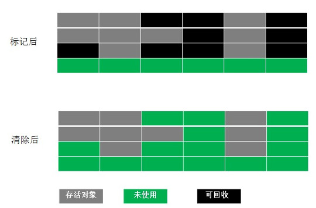

# Java垃圾回收机制

Jvm主要管理两种类型内存,堆和非堆

一般new的对象和数组都是在堆中的,也是GC时的大户

## 堆内存模型

堆内存分为两部分,新生代,老年代1:2

老年代主要存放程序中生命周期长的存活对象

新生代分为三部分:一个Eden区两个Survivor区,8:1:1

Eden存放新生对象

Survivor存放每次垃圾回收后存活的对象

## 可回收对象的判定

### 1.引用记数法

给对象中添加一个引用计数器,每当有一个地方引用他时,计数值就加1,引用失效时,计数器值就减1

任何时刻计数器为0的对象就是不可能再被使用的

优点:简单高效

缺点:难以处理循环引用

### 2.可达性分析算法/根搜索算法

从GC Roots作为起点,向下搜索他们引用的对象,可以生成一颗引用树,树的节点视为可达对象,反之视为不可达

所以只要没有被GC Roots引用的依然会被回收

GC Roots对象的定义

1.虚拟机栈(帧栈中的本地变量表)中引用的对象

2.方法区中静态属性引用的对象

3.方法区中常量引用的对象

4.本地方法栈中JNI引用的对象

## GC时卡顿的原因

垃圾回收的时候,需要整个引用保持状态不变,否则判定是垃圾,所以GC的时候,其他所有程序执行处于暂停状态

Stop The World

## 几种垃圾回收算法

### 1.标记清除法(Mark-Sweep)

标记清除法分两个阶段

标记阶段需要标记出所有需要被回收的对象,清除阶段就是回收被标记的对象

优点:简单,容易实现

缺点:容易产生内存碎片,碎片太多如果后续需要一块大对象时,需要提前触发一次垃圾回收操作

### 2.复制算法(Copying)

将可用内存按照容量一分为二,每次只使用其中一块,当这一块用完了,将还活着的对象赋值到另一块,然后清理掉原来那块空间

优点:实现简单,运行高效,不容易产生内存碎片

缺点:对内存空间的使用做出了高昂的代价,因为只能使用原来的一半

### 3.标记整理算法(Mark-Compact)

标记阶段和标记清除法一样,然后将存活对象都向一端移动,然后清理掉端边界以外的内存

适用于存活对象多,回收对象少

### 4.分代回收算法

根据对象存活的生命周期将内存划分若干个不同的区域,一般分为老年代和新生代

对于新生代采用复制Copying算法,因为新生代要回收的对象多

对于老年代采用标记整理法,因为老年代每次只有少量对象要被回收

## 总结

需要对象是否存活和怎么清除回收对象

## 参考

http://jayfeng.com/2016/03/11/%E7%90%86%E8%A7%A3Java%E5%9E%83%E5%9C%BE%E5%9B%9E%E6%94%B6%E6%9C%BA%E5%88%B6/

http://www.cnblogs.com/ityouknow/p/5614961.html