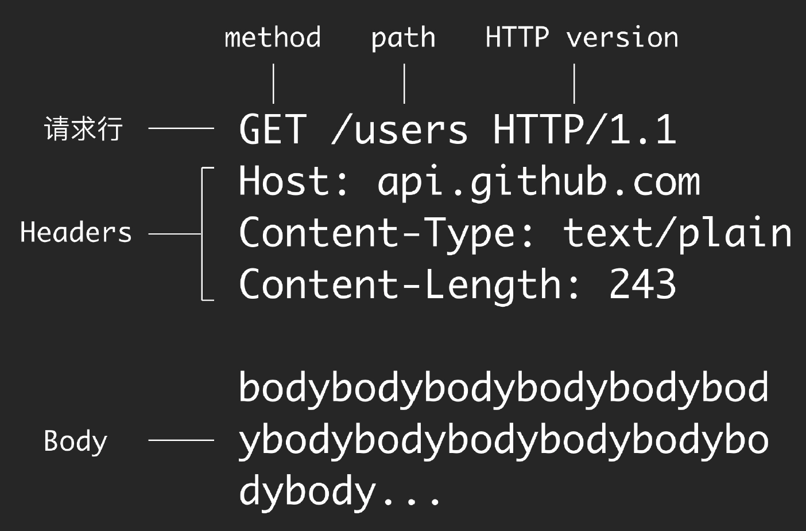
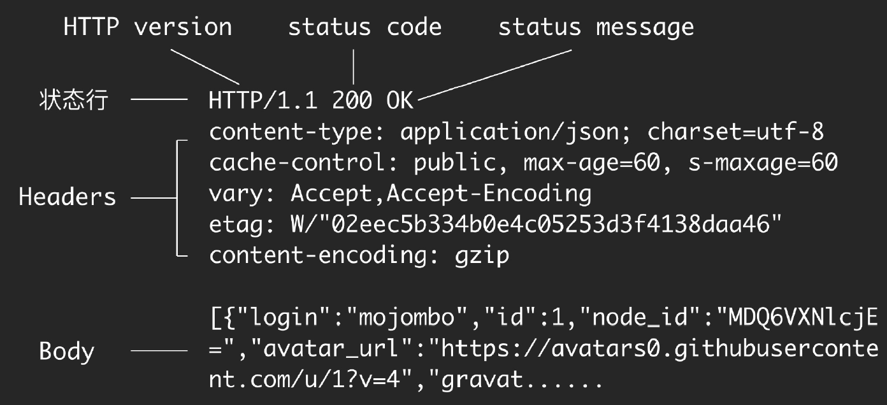

# Http

## 概念

Hypertext Transfer Protocol超文本传输协议,位于应用层

超文本,即扩展型文本,指的是HTML中可以链向别的文本链接

## 工作方式

### 浏览器

用户输入网址或者点击链接->

浏览器拼装HTTP报文并发送请求到服务器->

服务器处理请求后发送响应报文给浏览器->

浏览器解析响应报文并且使用渲染引擎显示

### 手机App

用户点击或者界面自动触发联网请求->

Android代码拼装HTTP报文并发送请求到服务器->

服务器处理请求后发送响应报文到手机->

Android代码处理响应报文并做出相应处理(展示,存储都可以)

## URL格式

协议类型,服务器地址(和端口号),路径(Path)

协议类型://服务器地址[:端口号]路径

https://github.com/he303954106/LearningNote

## 报文格式

### 请求报文

状态行,Headers,Body

### 响应报文

## 请求方法

GET,POST,PUT,DELETE,HEAD

## 状态码

三位数

1XX:临时性消息,100(继续发送),101(正在切换协议)

2XX:成功,200(OK),201(创建成功)

3XX:重定向,301(永久移动),302(暂时移动),304(内容未改变)

4XX:客户端错误,400(客户端请求错误),401(认证失败),403(被禁止),404(找不到内容)

5XX:服务器错误,500(服务器内部错误)

