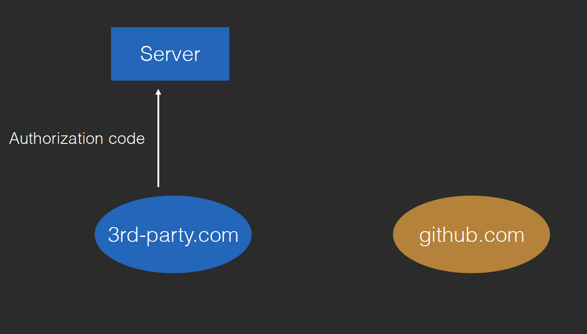
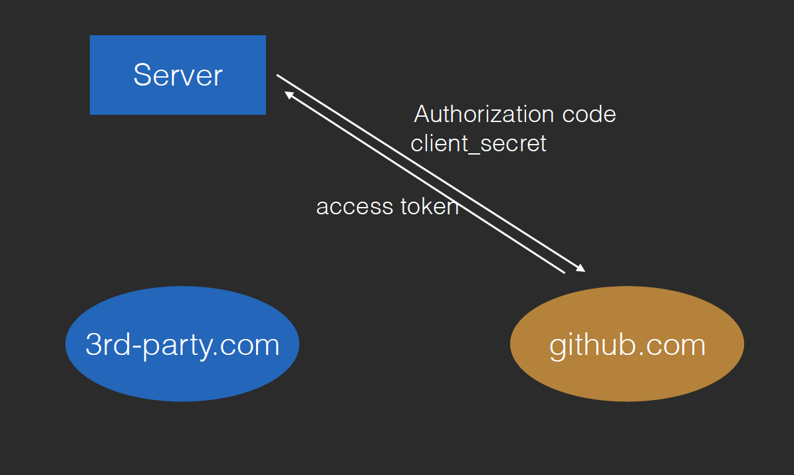
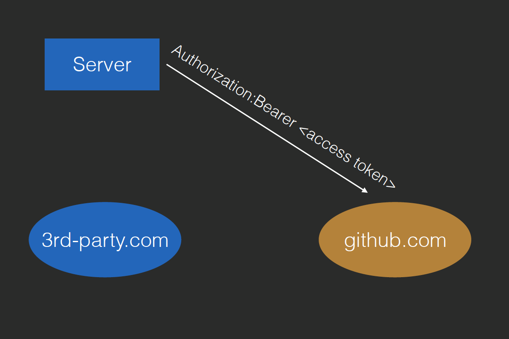
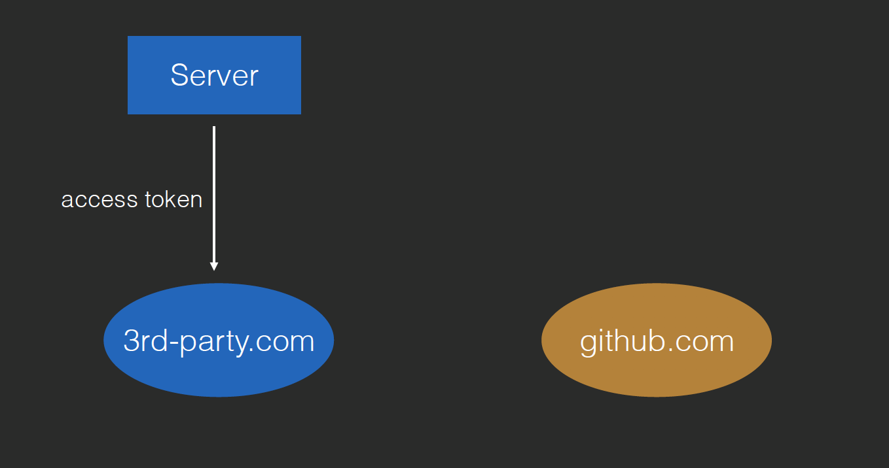

# OAuth2

## 授权登录

0.第三方网站向授权方网站申请第三方合作,得到client_id和client_secret

1.用户在第三方网站点击授权登录时,第三方网站就跳转至授权方网站,带上client_id来验明身份

2.授权方根据client_id,将第三方网站的信息和第三方网站需要的用户权限告知用户,是否同意授权

3.用户点击同意授权后,授权方会返回第三方网站,并将Authorization code 作为用户认可的凭证

4.第三方网站将Authorization code发送回自己的服务器

5.服务器将Authorization code和client_secret一并发送给授权方,返回access_token,OAuth流程结束

使用Authorization Code的原因是在于授权过程不强制是Https,所以直接返回access token有风险

