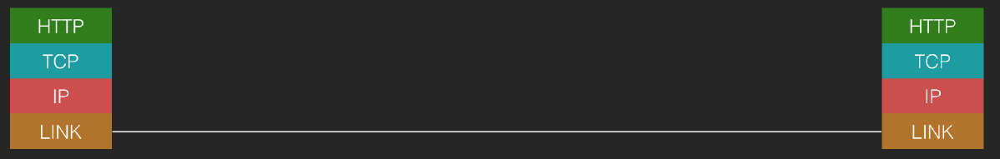
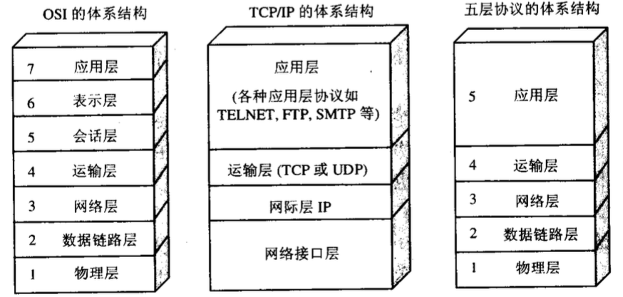

# 网络分层

## 分层的原因

网络不稳定,如果链接能一次成功,根本就不需要分层

## TCP/IP体系结构

应用层(Application) HTTP,FTP,DNS

传输层(Transport) TCP,UDP

网络层(Internet) IP

数据链路层(Link) 以太网,WIFI

## OSI体系结构

(Open System Interconnection Reference Model)

第一层：物理层（Physical） 
第二层：数据链路层（Data-Link） 
第三层：网络层（NetWork） 
第四层：传输层（Transport） 
第五层：会话层（Session） 
第六层：表示层（Presentation） 
第七层：应用层（Application）

一句话：Please Do Not Tell Stupid People Anything

