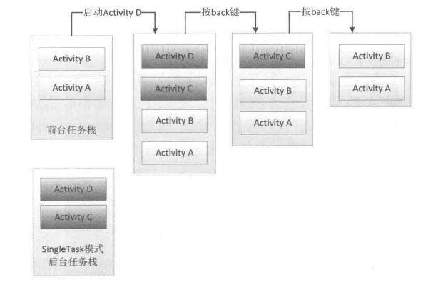
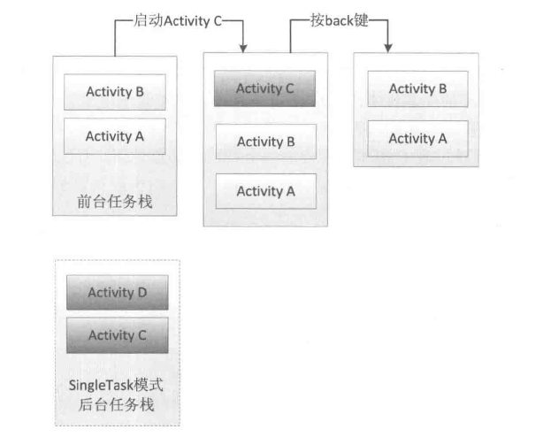

# 启动模式

## standard

标准模式,默认模式,每次启动都会重新创建一个新的实例,谁启动了这个Activity,这个Activity就会进入到相应的任务栈当中,所以当使用ApplicationContext启动时需要加上FLAG_ACTIVITY_NEW_TASK标记位来创建一个新的栈来存放(并且这个Activity已经是由singleTask模式启动了)

## singleTop

栈顶复用模式,如果新Activity已经在栈顶则不会被重新创建,onCreate,onStart不会被调用,onNewIntent,onResume会被调用(singleTop不具备clearTop,如果不在栈顶,还会重新创建实例)

## singleTask

栈内复用模式,只要Activity已经在这个栈中存在,则会clearTop,生命周期和singleTop一样

如果不存在,则会创建一个新的任务栈将Activity放到栈中

相同的taskAffinity的Activity们会在同一个栈中,如果其他栈调用这个栈中的Activity,这个Activity会clearTop,然后带着在他下面的Activity一并压入调用他的Activity的栈中(前台任务栈)

## singleInstance

单实例模式,属于加强的singleTask,这种模式的Activity只能单独的存在于一个任务栈中(优先级高于taskAffinity)

## Activity的Flags

FLAG_ACTIVITY_NEW_TASK相当于singleTask

FLAG_ACTIVITY_SINGLE_TOP相当于singleTop

FLAG_ACTIVITY_CLEAR_TOP会清空相同栈的Activity一般和FLAG_ACTIVITY_NEW_TASK配合使用

相关链接

https://developer.android.com/guide/components/tasks-and-back-stack?hl=zh-cn

https://www.jianshu.com/p/2a9fcf3c11e4

