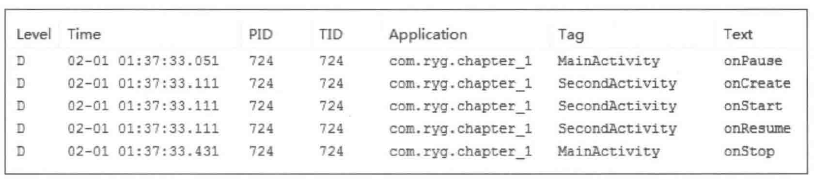
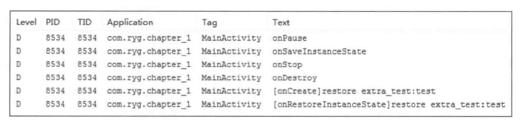
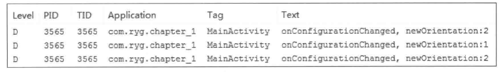

# 生命周期

1.onResume是已经可见了跟onPause是一组,在onStart之后调用,此时Activity在前台

2.onStart就是那种可见了,但是不一定在前台显示了,例如一些透明主题的后面

3.Activity从后台回到前台的调用顺序,onRestart->onStart->onResume

4.onStart和onStop是从可见角度来回调,onResume和onPause是从是否位于前台回调

5.不能在onPause做重量级操作,因为新Activity需要在之前的Activity的onPause执行完才会调用onCreate onResume等

6.Activity在意外情况下,调用onSaveInstanceState来保存临时数据,onSaveInstanceState会在onDestroy之前调用,

再次恢复时会调用onRestoreInstanceState可以在这里或者onCreate恢复数据

7.如果在清单文件中配置了android:configChanges选项,就只会调用onConfigurationChanged方法